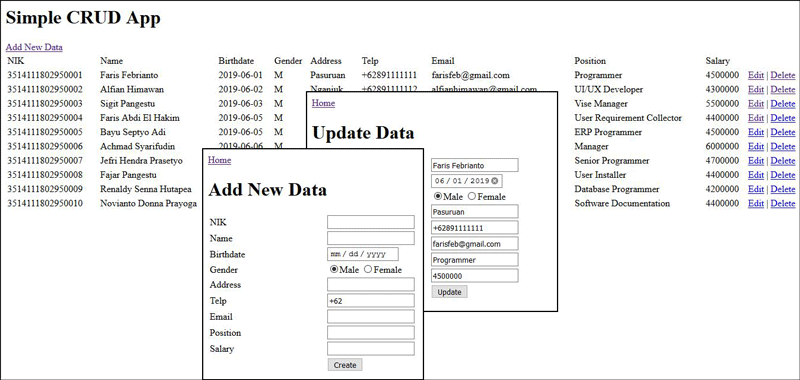

# Simplecrud

## Description

[Simplecrud](https://github.com/farisfebrianto/simplecrud) is basic PHP with MariaDB create, read, update, and delete operations. Even this code is simple, can you code in Windows notepad from scratch without internet connection?. Actually this happen to me on job test but I can't do it! LOL..

## Screenshot

## Features

1. CRUD (create, read, update, and delete) operation
2. No layout added, just table width

## Run

1. Start your http and database server, mine is Apache and MariaDB
2. Import simplecrud.sql
3. Run on your favorite web browser
